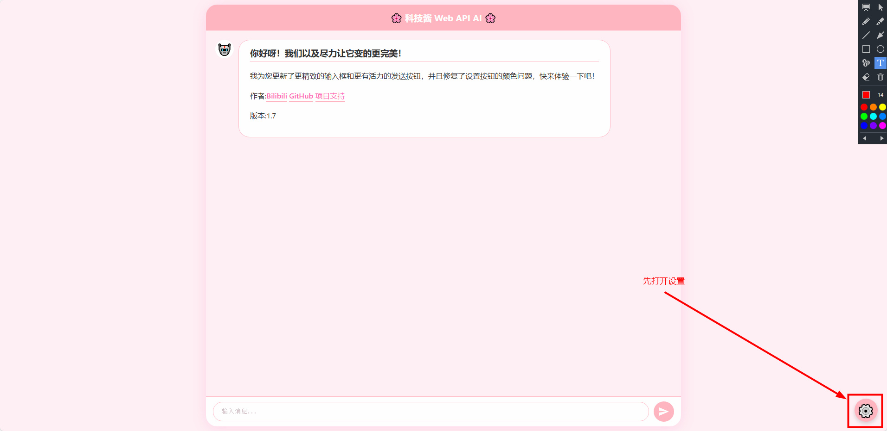
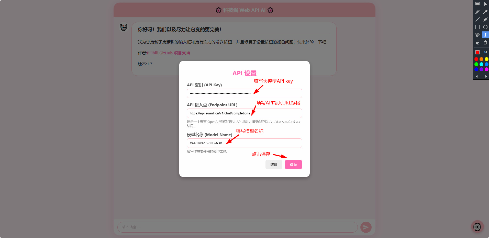
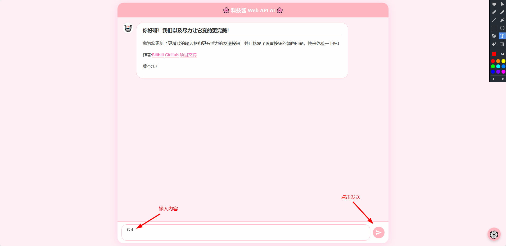

# KeJiJiang(科技酱) Web API AI
## 科技酱 互联网(Web)应用程序接口(API)人工智能(AI)
文件为html单文件  
通过多次更改，优化，美化，改进  
兼容OpenAI格式API  
可在内部“设置”导入大模型API接口在Web网页前端实现大模型聊天对话
## 使用教程
### 先点击“设置”

### 填写大模型API key👉填写API接入URL链接👉模型名称👉点击"保存"

### 在下方款中填写需要问大模型的内容👉点击发送

### 尽可使用

## 如果你觉得不错可以对我们进行捐赠，我们没有稳定的收入，感谢大家的支持

